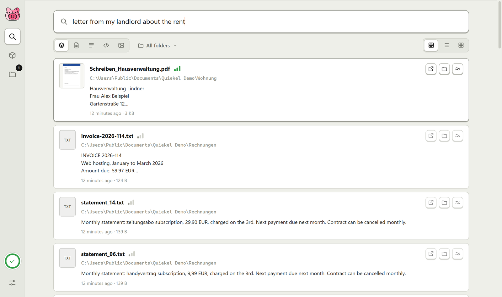
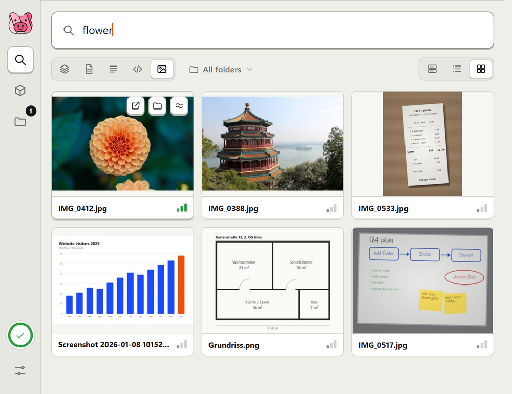
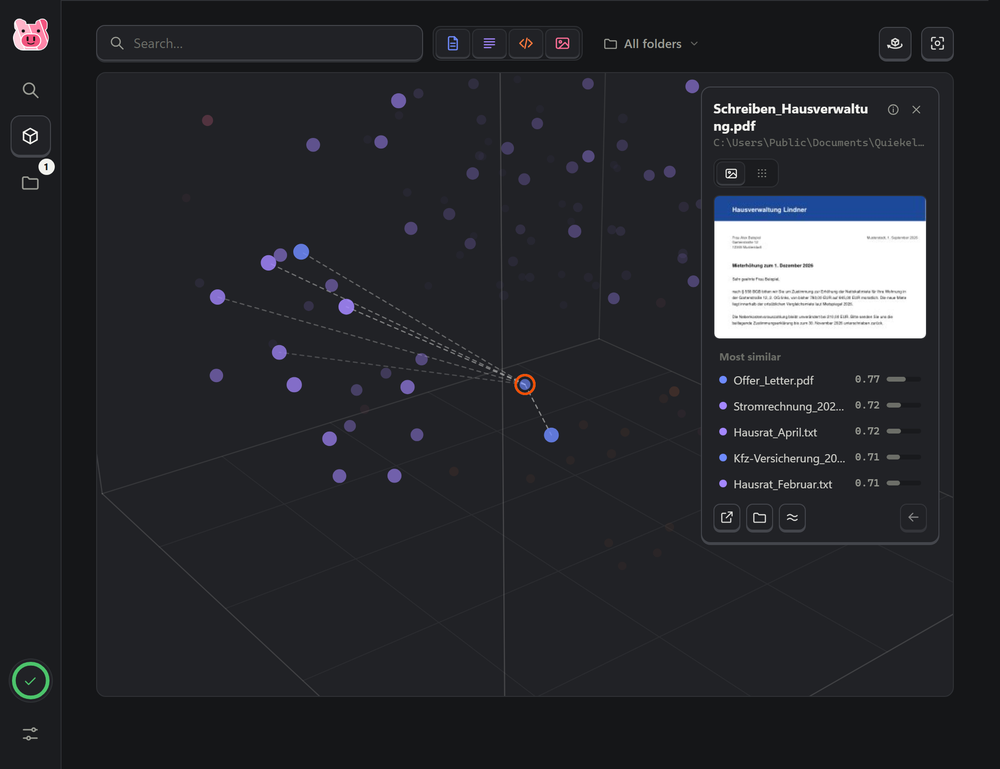

<p align="center">
  <picture>
    <source media="(prefers-color-scheme: dark)" srcset="src/quiekel_embed/static/pig-dark.svg">
    
  </picture>
</p>

<h1 align="center">Quiekel Embed</h1>

<p align="center">Search your own files by what's <em>in</em> them. Locally, on your PC.</p>

<p align="center">
  <picture>
    <source media="(prefers-color-scheme: dark)" srcset="docs/screenshots/search-dark.png">
    
  </picture>
</p>

- **Meaning, not just keywords.** Ask in your own words, in any of 100+ languages: the question above is English, the letter it found is German.
- **Documents, code and photos.** PDF, Word, PowerPoint, Excel, text and code, even inside ZIP files, and photos are found by what they show.
- **Private.** The AI model runs on your own graphics card (or CPU). Your files and searches never leave your PC.
- **Stays out of your way.** It keeps your folders up to date in the background and backs off for games and busy apps.

## Install

Windows 10 or 11. Open **PowerShell** and paste:

```powershell
irm https://github.com/catdrinkmonster/quiekel-embed/raw/main/install.ps1 | iex
```

It sets up what's missing (uv, and Git if needed), installs **Quiekel Embed** into your user folder,
puts it on your Desktop and starts it. All in all it downloads about 4.5 GB (the AI model included)
and takes about 6.5 GB of disk. An NVIDIA graphics card makes it much faster but isn't required.
To update, run the line again, or switch on update checks in Settings.

<details>
<summary>Install by hand, or uninstall</summary>

By hand, with [uv](https://docs.astral.sh/uv/) and [Git](https://git-scm.com/) installed:

```powershell
git clone https://github.com/catdrinkmonster/quiekel-embed "$env:LOCALAPPDATA\Programs\Quiekel Embed"
cd "$env:LOCALAPPDATA\Programs\Quiekel Embed"
uv sync --locked
uv run quiekel-embed-shortcuts
```

To uninstall, quit Quiekel from its tray icon, then:

```powershell
cd "$env:LOCALAPPDATA\Programs\Quiekel Embed"; uv run quiekel-embed-shortcuts --remove; cd ~
Remove-Item -Recurse -Force "$env:LOCALAPPDATA\Programs\Quiekel Embed", "$env:LOCALAPPDATA\QuiekelEmbed"
```

The model stays in the Hugging Face cache (`~\.cache\huggingface`) in case other apps use it.
</details>

## A look inside

| Photos, found by what they show | A map of your files |
|---|---|
|  |  |
| "flower" finds `IMG_0412.jpg`, whatever its name. | Click a file: a preview, and its most similar files. |

1. **Add folders** with the folder button. Indexing runs in the background and keeps up with changes.
   A folder's ⓘ shows its numbers and any files that couldn't be read.
2. **Search.** Filter by documents, text, code or images, or by folder. Show results with the passage
   that matched, as a compact list of names, or as thumbnails. Hover anything for details.
3. **Explore** the map with the cube button. Light or dark, shortcuts, speed and memory are in Settings.

## Performance

Measured on a 20,000-file index against the previous version, back to back on a quiet desktop PC
(8-core CPU, NVIDIA GPU):

| | Before | After | |
|---|---:|---:|---:|
| Search (the app's own work) | 75.9 ms | 19.7 ms | **3.8×** |
| Similar files | 52.0 ms | 8.4 ms | **6.2×** |
| The map after a restart | 35.6 s | 48 ms | **745×** |
| New files on the map (and dots that move) | 70.5 s CPU (99.6%) | 0.3 s CPU (0%) | **226×** |
| Saving while indexing 20,000 files | 54.4 s | 17.6 s | **3.1×** |
| Start until the page loads | 2.16 s | 1.10 s | **2.0×** |

The price: the default *Fast* memory setting keeps search data in memory, about 1 KB per passage
(100 MB here). *Lean* doesn't.

<details>
<summary>How results are ranked</summary>

Files containing all your words come first (yellow **Aa**), then everything else by meaning, so the
signal bars only go down the list. Folder names count as words: "taxes 2024" finds files in a
*Taxes 2024* folder. Keyword search works right away at startup, while the model is still loading.
**Similar** finds files like the one you pick.
</details>

<details>
<summary>File types</summary>

| Filter | Files | Searched by |
|---|---|---|
| Documents | PDF, Word, PowerPoint, Excel | their text, in passages of about 1,500 characters; scanned PDFs by their first 3 pages as pictures |
| Text | `.txt`, `.md`, `.csv`, `.json`, `.yaml`, `.xml`, `.html`, `.log`, `.tex`, `.srt` and more | passages; web pages without their tags |
| Code | `.py`, `.ipynb`, `.js`, `.ts`, `.java`, `.c`, `.cpp`, `.cs`, `.go`, `.rs`, `.sql`, `.ps1` and more | passages (scripts open in an editor and never run) |
| Images | `.jpg`, `.png`, `.webp`, `.gif`, `.bmp`, `.tiff`, `.heic` | the picture itself |
| Inside ZIPs | all of the above, inside `.zip` archives | like files in a folder, without unpacking anything (a switch in Settings) |

Skipped: hidden and system files, `node_modules`, `.git`, virtual environments, `AppData`, build
output, icons under 96 px, and files that are too big (text over 5 MB, documents over 200 MB,
images over 80 MB).
</details>

<details>
<summary>Gentle on your PC</summary>

Indexing runs at Windows background priority, and a governor checks every 2 seconds how hard it may work:

| Signal | Balanced (default) | Gentle | Full speed |
|---|---|---|---|
| A fullscreen app (game, video, presentation) | pause | pause | keep going |
| Other apps using the CPU | slow down from 60%, nearly stop from 85% | from 25% / 50% | ignored |
| Other apps using the GPU | slow down from 35%, nearly stop from 70% | from 15% / 40% | ignored |
| Memory or GPU memory running low | slow down, pause when almost full | same | pause only when almost full |
| On battery | 25% speed | pause | ignored |
| You're using the PC / away for 3 minutes | 75% / full speed | 25% / 50% | full speed |

While it works, the load stays steady: files are read ahead while the GPU embeds, each batch is
prepared while the previous one runs, and slowing down means short pauses after every batch.
After 5 minutes without work, or while a fullscreen app runs, the model moves off the GPU and
gives its memory back; it returns within seconds when there's work.

Memory, in Settings: **Fast** (the default) keeps every passage's numbers in memory, so a search
is a few milliseconds of maths, and keeps the model ready. **Lean** leaves the search data on disk
and unloads the model after 5 unused minutes or for a game; the first search after a break then
takes a few seconds. The ⓘ next to Speed and Memory shows what each option does.
</details>

<details>
<summary>Updates, privacy and where things live</summary>

Update checks are off until you switch them on in Settings; then Quiekel looks for new releases every
6 hours (the button next to the switch checks once). When a new version is out, a badge appears in the
sidebar; one click installs it and restarts the app. Updates only install a `vX.Y.Z` release from the
protected `main` branch, with the hash-locked dependencies from `uv.lock`, and roll back if anything
fails.

The app goes online for two things only: downloading the model from Hugging Face on first start,
and, if you switch it on, the update check against `api.github.com`. Removing a folder deletes only its index entries:
**your files are never modified.** See [SECURITY.md](SECURITY.md) for how the app is locked down and
how to report a vulnerability.

| Path | What |
|---|---|
| `%LOCALAPPDATA%\QuiekelEmbed\state.db` | folders, settings, keyword index (SQLite) |
| `%LOCALAPPDATA%\QuiekelEmbed\vectors\` | embeddings (LanceDB), 256 numbers per passage |
| `%LOCALAPPDATA%\QuiekelEmbed\thumbs\` | cached previews |
| `%LOCALAPPDATA%\QuiekelEmbed\map.npz` | the map's layout, so it's there right away |
| `%LOCALAPPDATA%\QuiekelEmbed\quiekel-embed.log` | log file |

`QUIEKEL_EMBED_DATA`, `QUIEKEL_EMBED_PORT` (8765) and `QUIEKEL_EMBED_MODEL` override the defaults.
`uv run quiekel-embed` serves the same app in a browser tab at http://127.0.0.1:8765.
</details>

<details>
<summary>Development</summary>

```powershell
uv sync
uv run pytest
```

The pig is drawn by `scripts/make_icon.py`. All texts live in `src/quiekel_embed/static/i18n.json`
(English, German, French, Spanish); the tests check that every key is translated. Releases are
tagged `vX.Y.Z` on `main`, and the version comes from `pyproject.toml`.
</details>

## License

[MIT](LICENSE). Uses Google's [EmbeddingGemma 2](https://huggingface.co/google/embeddinggemma-2) (Apache 2.0).

<sub>The files in the screenshots are made up. The two photos are "flower.jpg" by vultilion and
"china.jpg" by danielbuechele (CC BY 2.0), as bundled with scikit-learn.</sub>
